# 🍽️ Restaurant Booking App

A Django-based web application that allows users to book tables at a restaurant. This project supports full user authentication, admin management, and CRUD operations for bookings.

---

## 💻 Technologies Used

- Python  
- Django  
- HTML & CSS  
- JavaScript  
- MySQL  

---

## 🔑 Key Features

- ✅ User registration and login  
- ✅ Book a table for specific date and time  
- ✅ Admin dashboard to view, edit, or delete bookings,tables and menus  
- ✅ CRUD operations for bookings
- ✅ Responsive and user-friendly design  

---

## 🗂️ Project Structure Highlights

- `templates/` – HTML pages (Home, Booking form)  
- `static/` – CSS and Image folders  
- `models.py` – Custom models for menus, tables, and bookings  
- `admin.py` – Admin controls for tables,bookings and menus

---

## 📷 Screenshots

- 🏠 **Homepage**  
  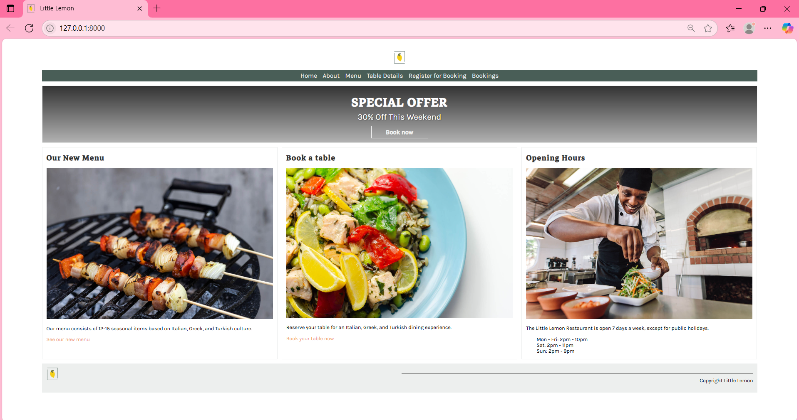

- ℹ️ **About Page**  
  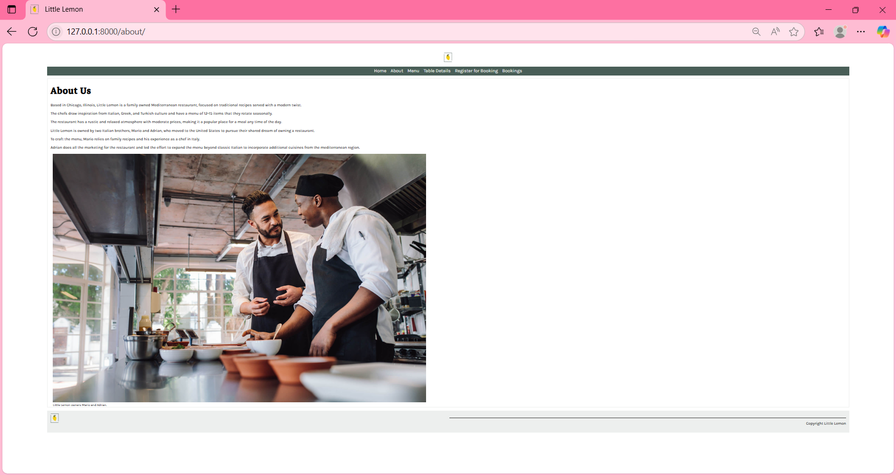

- 📜 **Menu Page**  
  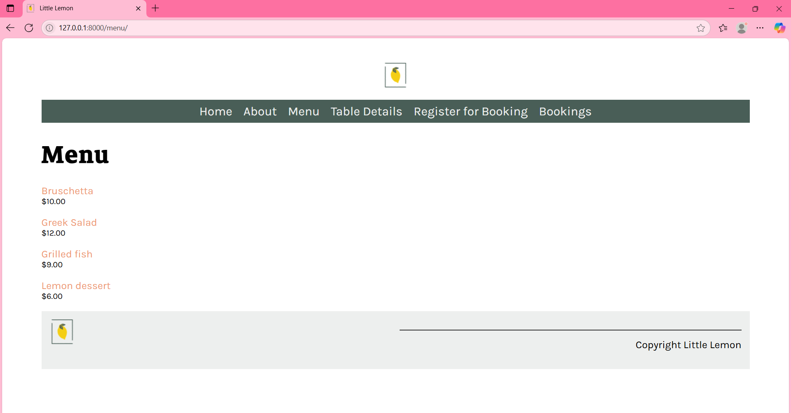

- 🍽️ **Menu Item Detail Page**  
  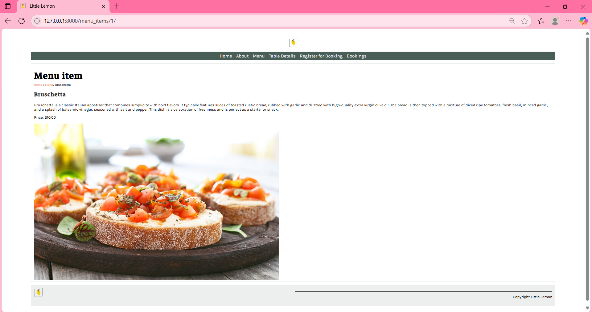

- 🪑 **Table Details Page**  
  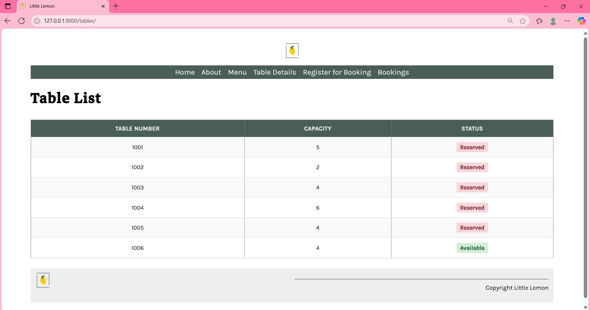

- 📝 **User Registration Page**  
  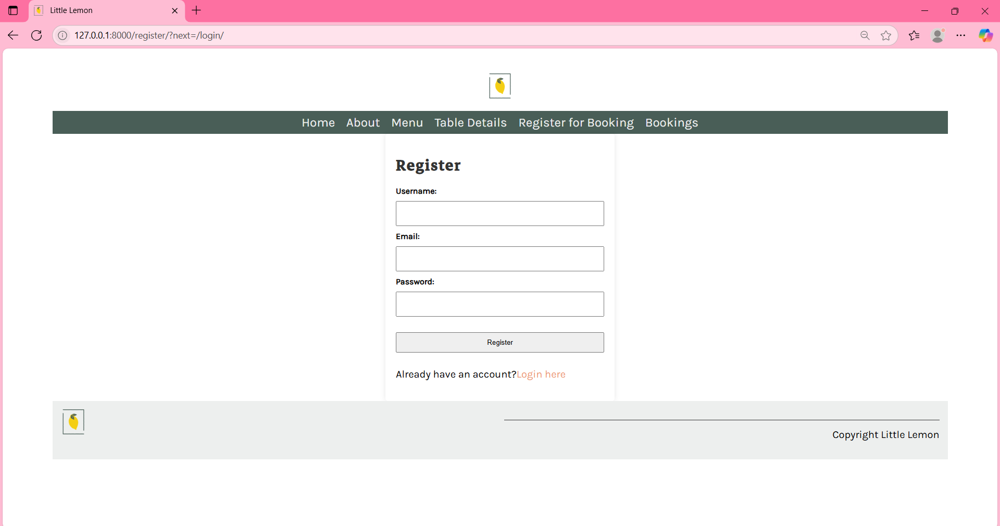

- 🔐 **Login Page**  
  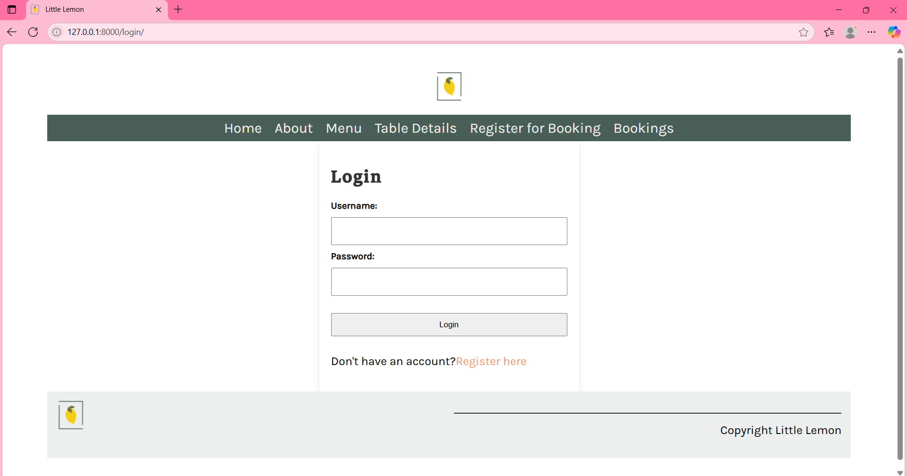

- 📅 **Booking Form Page**  
  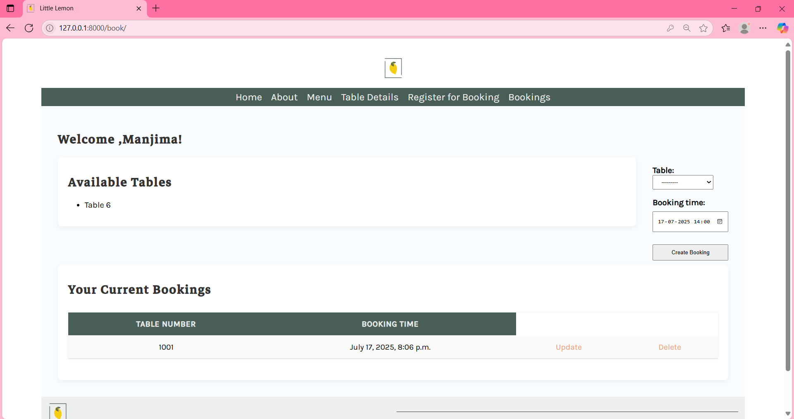

- ✏️ **Update Booking Page**  
  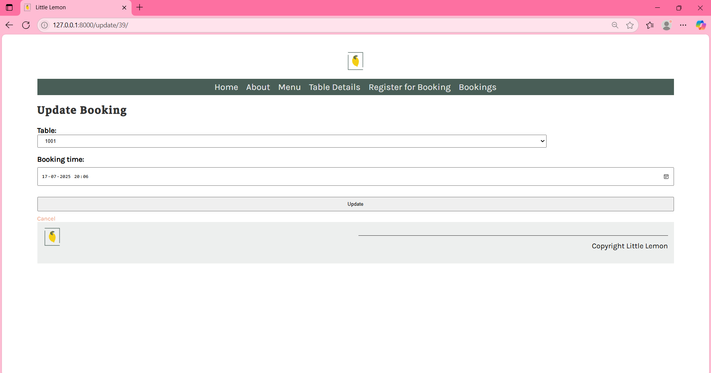

- ❌ **Delete Booking Confirmation**  
  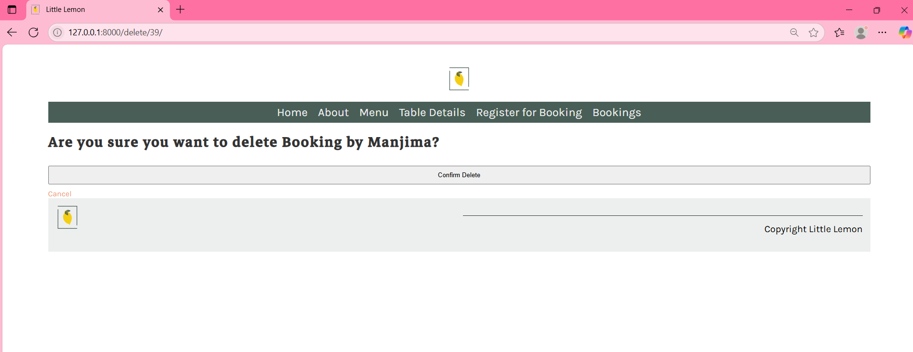

- 🔍 **View Single Booking**  
  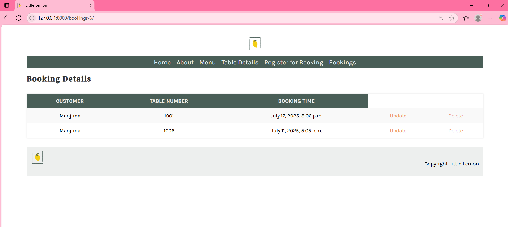

- 📋 **All Bookings List**  
  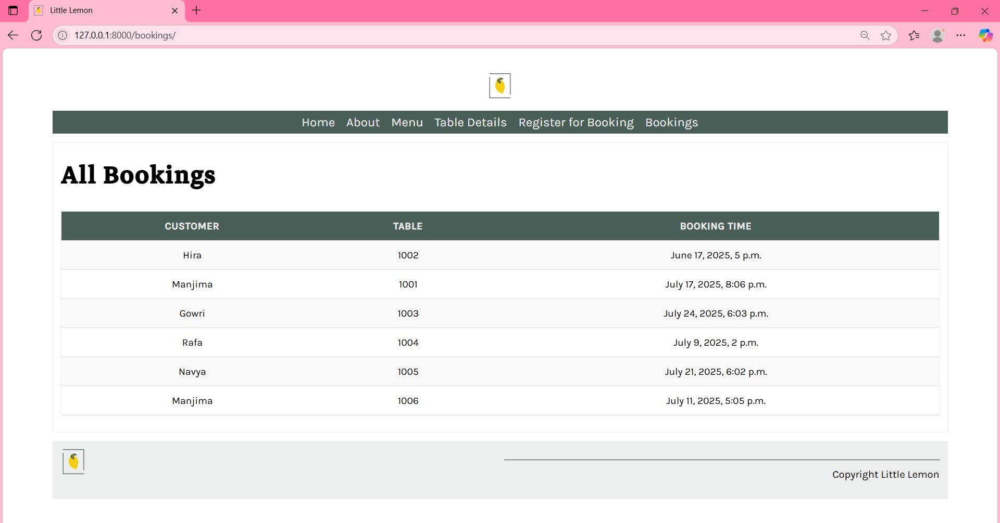

